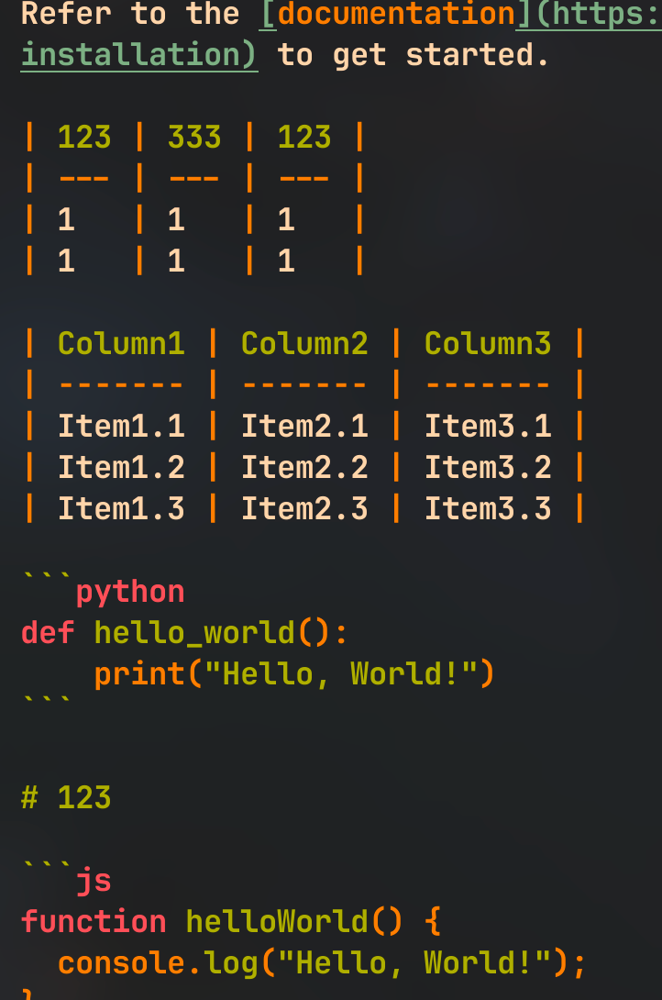

# 💤 LazyVim

A starter template for [LazyVim](https://github.com/LazyVim/LazyVim).
Refer to the [documentation](https://lazyvim.github.io/installation) to get started.

| 123 | 333 | 123 |
| --- | --- | --- |
| 1   | 1   | 1   |
| 1   | 1   | 1   |

| Column1 | Column2 | Column3 |
| ------- | ------- | ------- |
| Item1.1 | Item2.1 | Item3.1 |
| Item1.2 | Item2.2 | Item3.2 |
| Item1.3 | Item2.3 | Item3.3 |

```python
def hello_world():
    print("Hello, World!")
```

# 123

```js
function helloWorld() {
  console.log("Hello, World!");
}
```


